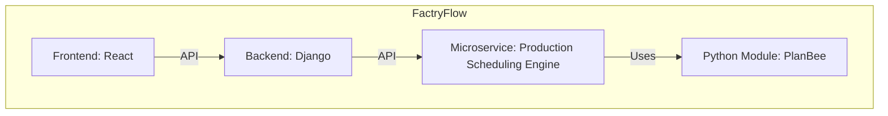

# FactryFlow Software Architecture

FactryFlow is a production scheduling software designed to optimize and streamline the production process. The software architecture is modular and consists of several key components, as illustrated in the diagram below:

## Components

1. **Frontend (React)**: This is the user interface of FactryFlow, built using the React framework. It provides users with an interactive platform to manage and view production schedules.

2. **Backend (Django)**: The backend is developed using the Django framework. It serves as the bridge between the frontend and the production scheduling engine, processing user requests and managing data.

3. **Microservice (Production Scheduling Engine)**: This is the heart of FactryFlow. It's responsible for the actual scheduling logic and optimization. The engine utilizes the PlanBee Python module to execute its scheduling algorithms.

4. **PlanBee Python Module**: An integral module that powers the scheduling engine with its algorithms.

## Communication

- The **Frontend** communicates with the **Backend** using an API, ensuring a seamless flow of data and requests.
  
- The **Backend** also communicates with the **Production Scheduling Engine** through an API, sending scheduling parameters and receiving optimized schedules in return.

This modular architecture ensures scalability, maintainability, and efficient performance, making FactryFlow a robust solution for production scheduling needs.